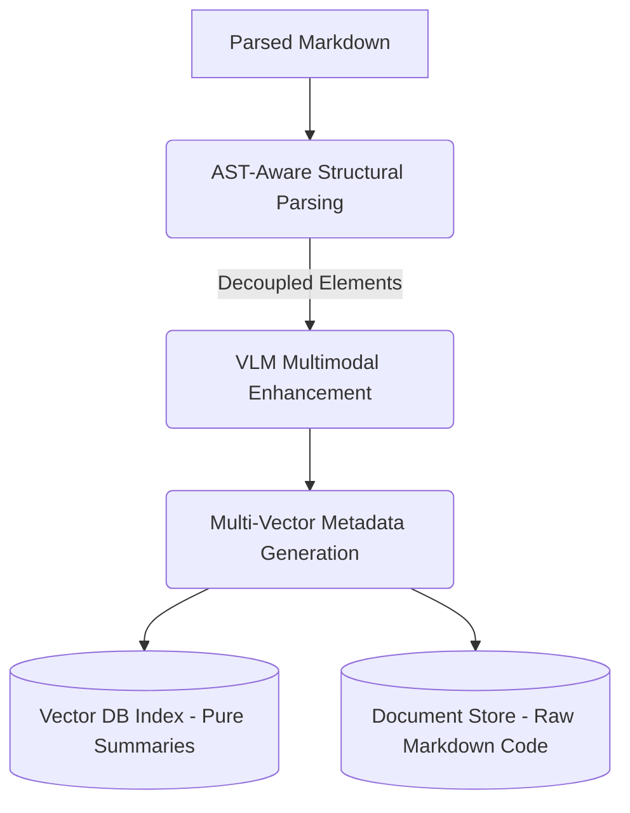

# RAG Enhanced Caption & Chunking Toolkit

[](https://opensource.org/licenses/Apache-2.0)
[](https://www.python.org/downloads/)

[**English**](README.md) | [**中文**](README_zh.md)

A modular multi-modal RAG (Retrieval-Augmented Generation) enhancement toolkit. This project provides decoupled modules for surgical Markdown context extraction, VLM-powered image/table captioning, and structure-aware semantic chunking based on a modern **Multi-Vector Architecture**.

Inspired by [RAG-Anything](https://github.com/HKUDS/RAG-Anything).

## 💡 Our Philosophy: Purpose-Driven vs. OCR-Driven

Unlike standard multimodal RAG tools that simply OCR and transcribe image text, this toolkit focuses on **illustrative intent**:
- **Context-Aware**: The VLM knows *where* the image/table is located and *what* the surrounding text says.
- **Intent-Focused**: It explains **why** an element exists (e.g., "This chart proves the high-concurrency capability mentioned in Section 2.1") rather than just listing numbers.
- **No Attention Hijacking**: By generating concise purpose-driven summaries, we prevent the LLM from getting "distracted" by irrelevant raw data inside images.

## 🎯 Scope & Prerequisites: The "Last Mile" of Document Processing

Please note that **this toolkit is designed to process *already parsed* Markdown documents.** It is not a PDF parser or an OCR engine (you can use tools like MinerU, Docling, or Marker for that upstream step). 

Our toolkit serves as the critical **"last mile"** processing step—refining, enriching, and structuring the Markdown data—right before it is ingested into a Vector Database for retrieval or used to construct a Knowledge Graph.

## ✨ Core Capabilities

- **VLM-Powered Enrichment (`enhancer`)**: Automatically analyzes images and tables. It extracts core business entities and generates high-density semantic summaries.
- **Surgical Context Extraction**: Uses `markdown-it-py` to gather deep situational awareness (breadcrumbs, parent headers, and neighboring paragraphs) for the VLM.
- **Structure-Aware Semantic Chunking (`chunker`)**: Unlike traditional naive character-count chunking, our engine uses AST (Abstract Syntax Tree) parsing to preserve Markdown document hierarchy and leverages Embedding models for true semantic splitting.

### 🧬 The Multi-Vector Pipeline

Our chunking engine operates through a sophisticated multi-stage pipeline designed to maximize context retention while completely decoupling noisy markdown code from vector embeddings:

1.  **Stage 1: AST Structural Parsing**: Using `markdown-it-py`, the document is decomposed into a hierarchy of tokens. Structural elements (Tables, Math Blocks, Images) are recognized and **decoupled** from regular text paragraphs.
2.  **Stage 2: Contextual Breadcrumbs**: Every chunk automatically receives the full heading path (e.g., `["Root", "Parent", "Subtitle"]`) as metadata. 
3.  **Stage 3: Image-Caption Binding**: A specialized detector forces image links and their subsequent captions to stay in the same chunk.
4.  **Stage 4: Asymmetric Embedding (Multi-Vector)**:
    *   **Child Nodes (Elements)**: Tables and images are treated as independent Child Nodes. Only their **pure VLM-generated semantic summaries** are vectorized.
    *   **Parent Nodes (Text)**: The raw, full Markdown code (e.g., complex HTML tables or LaTeX) is kept safe in a Document Store and never fed directly to the embedding model, preventing "vector pollution".

## 🔄 Dual-Track Processing System & Output Format

This toolkit outputs pure, perfectly structured JSONL data, ready for large-scale RAG deployments. 

Instead of mixing everything, we utilize a **Multi-Vector Architecture** (decoupling the text used for search from the text used for LLM generation).

1.  **Track 1: Vector DB Payload (`_index.jsonl`)**
    *   **Purpose**: To be ingested into expensive, high-performance Vector Databases (like Milvus or Qdrant).
    *   **Format**: Contains extremely lightweight, high-density semantic text (VLM summaries or pure text paragraphs). No noisy markdown tables or raw image links.
    ```json
    {
        "id": "chunk_001",
        "text_for_embedding": "A high-density VLM summary explaining the core message of the table.",
        "metadata": {"element_type": "Table"}
    }
    ```

2.  **Track 2: Document Store Payload (`_docstore.jsonl`)**
    *   **Purpose**: To be stored in cheaper, high-capacity NoSQL databases (like MongoDB or Redis). 
    *   **Format**: Contains the heavy, context-rich blocks. During retrieval, the Vector DB hits a lightweight child hook, which then retrieves the full context from this Document Store.
    ```json
    {
        "id": "chunk_001",
        "full_content": "| Raw | Markdown | Table | ...", 
        "parent_id": "chunk_000",
        "header_path": ["Chapter 1", "Section 1.1"],
        "element_type": "Table",
        "entities": ["Metric A", "Value B"]
    }
    ```

### 🌊 Architecture / Workflow



## 🚀 Quick Start

### Installation

#### As a Library (Recommended for other projects)
You can install this toolkit directly from GitHub or as a local editable package:

```bash
# Install from GitHub
pip install git+https://github.com/Flying-Henanese/rag_enhanced_caption.git

# Or install from local source
git clone https://github.com/Flying-Henanese/rag_enhanced_caption.git
cd rag_enhanced_caption
pip install .
```

#### For Development
Use `uv` for a streamlined development environment:

```bash
# Clone and setup
git clone https://github.com/Flying-Henanese/rag_enhanced_caption.git
cd rag_enhanced_caption
uv sync
```

### ⚙️ Configuration
Create a `.env` file in your working directory (or the project root):
```env
VLM_API_KEY=your_key_here
VLM_ENDPOINT=https://api.siliconflow.cn/v1/chat/completions
VLM_MODEL_NAME=Qwen/Qwen2.5-VL-72B-Instruct  # Recommended
# ... other optional keys
```

### 1. Using the CLI
After installation, you can use the `rag-caption` command globally:

```bash
# Process a markdown file and output to a directory
rag-caption ./input.md ./output_dir
```

### 2. Using as a Python Library
```python
from rag_enhanced_caption import MarkdownMultimodalProcessor, create_default_vlm_client

async def main():
    vlm_client = create_default_vlm_client()
    processor = MarkdownMultimodalProcessor(vlm_func=vlm_client)
    
    enriched_md = await processor.enrich_markdown(
        md_content="# My Document...",
        base_dir="./images"
    )
    print(enriched_md)
```

### 3. Advanced RAG with LlamaIndex

Because this toolkit outputs extremely clean data, you can build enterprise-grade retrieval pipelines. We provide an excellent example in `examples/llama_index_advanced_rag.py`.

It demonstrates how to build a **4-Stage Retrieval Engine** to achieve perfect precision and massive context:

1.  **Vector Search (The Scout)**: Searches the `_index.jsonl` to find the most relevant pure text or VLM summaries (Top-15).
2.  **Recursive Retrieval (The Fetcher)**: When a VLM summary is hit, it acts as a pointer. The retriever goes into the `_docstore.jsonl` to fetch the raw, full Markdown Table or Image.
3.  **Rerank (The Sniper)**: Applies a Cross-Encoder Reranker. **Crucially, we do this BEFORE auto-merging.** Since the chunks are still small, the reranker can score them with extreme precision without triggering the fatal 512-token truncation limit. It filters the results down to the best Top-5.
4.  **AutoMerging (The Synthesizer)**: The system checks if multiple highly-scored chunks belong to the same chapter (using the `header_path`). If so, it dynamically merges them, outputting a massive, coherent chapter to the LLM.

```bash
# Run the advanced retrieval demo
uv run python examples/llama_index_advanced_rag.py
```

### 2. Data Ingestion Pipeline (Standalone)

This script demonstrates how to read a raw Markdown document, use the semantic chunker, enrich it with the VLM, and save the decoupled output as `_docstore.jsonl` and `_index.jsonl`.
```bash
uv run python examples/data_ingestion_pipeline.py
```

### 3. API & Web Demo
We provide a FastAPI backend to demonstrate the full pipeline interactively.
```bash
uv run python backend/main.py
```

### 📊 Comparative Benchmark (The "Dimensional Strike")

We have performed extensive comparative tests using complex technical documents like **PaddleOCR** and **RAG-Anything**:

| Test Case | Naive RAG (Baseline) | Our Toolkit (Advanced Strategy) | Outcome |
| :--- | :--- | :--- | :--- |
| **Complex Tables** | Often slices tables mid-row; loses column context. | Multi-Vector Pointer + Recursive Retrieval of the entire table. | ✅ Perfect 100% recall of structured data. |
| **Multi-modal Intent** | Recalls raw URLs/Alt-text; LLM is "blind". | VLM-enriched summaries used for vector search. | ✅ High-precision retrieval based on true illustrative intent. |
| **Deep Hierarchy** | Recalls isolated bullet points; loses context. | Breadcrumbs + AutoMerging climbs the AST tree for full chapters. | ✅ Complete context with zero semantic fragmentation. |
| **Large Context + Rerank** | Large merged chunks get truncated by Reranker. | Pipeline swaps order: Rerank small chunks *first*, then Merge. | ✅ Perfect scoring + Zero truncation. |

## 🛠️ Project Structure

```text
rag_enhanced_caption/
├── src/
│   └── rag_enhanced_caption/        # Top-level package
│       ├── cli.py                   # Command Line Interface (Main Entry)
│       ├── chunker/                 # AST-Aware Semantic Chunking
│       └── enhancer/                # VLM Enrichment
├── examples/                        # Demonstrations & Evaluation Scripts
│   ├── data_ingestion_pipeline.py   # Multi-Vector Data Ingestion
│   └── llama_index_advanced_rag.py  # 4-Stage Advanced Retrieval Engine
├── backend/
│   ├── main.py                      # FastAPI Web Server
│   └── rag_pipeline.py              # Advanced LlamaIndex wrapper module
└── tests/                           # Unified test suite
```

## 📄 License
Apache-2.0 License.