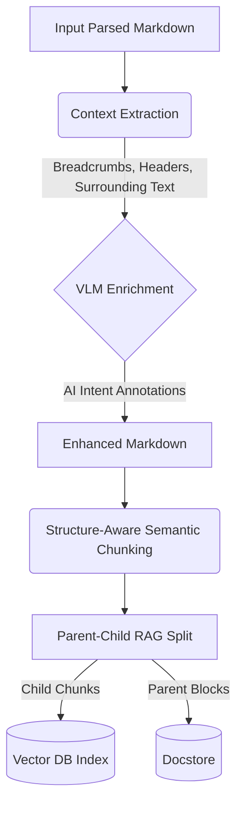

# RAG Enhanced Caption & Chunking Toolkit

[](https://opensource.org/licenses/Apache-2.0)
[](https://www.python.org/downloads/)

[**English**](README.md) | [**中文**](README_zh.md)

A modular multi-modal RAG (Retrieval-Augmented Generation) enhancement toolkit. This project provides decoupled modules for surgical Markdown context extraction, VLM-powered image/table captioning, and structure-aware semantic chunking.

Inspired by [RAG-Anything](https://github.com/HKUDS/RAG-Anything).

## 💡 Our Philosophy: Purpose-Driven vs. OCR-Driven

Unlike standard multimodal RAG tools that simply OCR and transcribe image text, this toolkit focuses on **illustrative intent**:
- **Context-Aware**: The VLM knows *where* the image/table is located and *what* the surrounding text says.
- **Intent-Focused**: It explains **why** an element exists (e.g., "This chart proves the high-concurrency capability mentioned in Section 2.1") rather than just listing numbers.
- **No Attention Hijacking**: By generating concise purpose-driven summaries, we prevent the LLM from getting "distracted" by irrelevant raw data inside images.

## 🎯 Scope & Prerequisites: The "Last Mile" of Document Processing

Please note that **this toolkit is designed to process *already parsed* Markdown documents.** It is not a PDF parser or an OCR engine (you can use tools like MinerU, Docling, or Marker for that upstream step). 

Our toolkit serves as the critical **"last mile"** processing step—refining, enriching, and structuring the Markdown data—right before it is ingested into a Vector Database for retrieval or used to construct a Knowledge Graph.

## ✨ Core Capabilities

- **VLM-Powered Enrichment (`enhancer`)**: Automatically analyzes images and tables. Analysis results are injected as collapsible `<details>` blocks **directly below** the element for optimal cognitive flow.
- **Surgical Context Extraction**: Uses `markdown-it-py` to gather deep situational awareness (breadcrumbs, parent headers, and neighboring paragraphs) for the VLM.
- **Structure-Aware Semantic Chunking (`chunker`)**: Unlike traditional naive character-count chunking, our engine uses AST (Abstract Syntax Tree) parsing to preserve Markdown document hierarchy and leverages Embedding models for true semantic splitting.

### 🧬 The Hybrid Chunking Pipeline

Our chunking engine operates through a sophisticated multi-stage pipeline designed to maximize context retention while minimizing noise:

1.  **Stage 1: AST Structural Parsing**: Using `markdown-it-py`, the document is decomposed into a hierarchy of tokens. This ensures that structural elements like tables, math blocks, and code fences are treated as atomic units and not arbitrarily sliced.
2.  **Stage 2: Contextual Breadcrumbs**: For every chunk generated, the engine automatically injects the full heading path (e.g., `# Root|Parent|Subtitle`) as a prefix. This "situational awareness" ensures that even isolated chunks carry their original document context.
3.  **Stage 3: Image-Caption Binding**: A specialized detector looks for image links followed by captions (e.g., `\nFigure 1: Describe`). It forces these pairs to stay in the same chunk to prevent semantic decoupling during retrieval.
4.  **Stage 4: Hierarchical Semantic Splitting**:
    *   **Paragraph Level**: First, it attempts to split at natural paragraph boundaries (`\n\n`).
    *   **Line Level**: If a paragraph is too long, it attempts to split at line breaks (`\n`).
    *   **Vector Clustering (The "Fail-Safe")**: If a single line exceeds the token limit, the engine triggers an **Embedding-based clustering algorithm**. It converts sentences into vectors and uses semantic similarity to find the most logical "cut points," ensuring that even long sentences are split at semantically meaningful locations rather than mid-word.

- **Parent-Child RAG Strategy**: A built-in workflow to split documents into searchable high-density "Child" chunks (AI intent summaries) and context-rich "Parent" blocks (original content).
- **Fully Decoupled**: Use the chunker or the enhancer independently or together.

## 🔄 Dual-Track Processing System

This toolkit outputs data in two parallel tracks, ensuring you have both human-readable previews and enterprise-grade data structures ready for large-scale RAG deployments.

1.  **Track 1: Markdown Slicing & Preview**
    *   **Enriched Markdown (`_enhanced.md`)**: Generates a `.md` file with delimited chunks (`---`) and complete AI annotations. Ideal for human review, comparison, or documentation portals.
2.  **Track 2: Enterprise Parent-Child Hierarchical Storage**
    *   **Vector DB Payload (`_index.jsonl`)**: Lightweight semantic hooks (only AI summaries and parent pointers). Designed to be ingested into expensive, high-performance Vector Databases (like Milvus or Qdrant) without bloating the memory.
    *   **Document Store Payload (`_docstore.jsonl`)**: The heavy, context-rich "Parent" blocks (containing original Markdown, tables, and VLM JSON payloads). Designed to be stored in cheaper, high-capacity NoSQL databases (like MongoDB or Redis). During retrieval, the Vector DB hits a lightweight child hook, which then retrieves the full parent context from this Document Store to feed the LLM.

### 🌊 Architecture / Workflow



## 🚀 Quick Start

### Installation

```bash
# Clone the repository
git clone https://github.com/Flying-Henanese/rag_enhanced_caption.git
cd rag_enhanced_caption

# Install dependencies using uv
uv sync
uv sync --extra local # Optional: for local embedding support
```

### ⚙️ Configuration
Create a `.env` file in the root directory:
```env
VLM_API_KEY=your_key_here
VLM_ENDPOINT=https://api.siliconflow.cn/v1/chat/completions
VLM_MODEL_NAME=Qwen/Qwen3-VL-8B-Instruct
# If using semantic chunking with remote embeddings:
EMBEDDING_API_KEY=your_key_here
EMBEDDING_ENDPOINT=https://api.siliconflow.cn/v1/embeddings
EMBEDDING_MODEL_NAME=BAAI/bge-m3
```

### 1. Command Line Interface (CLI) - Recommended

Run the included CLI tool to process a document through the full pipeline (Chunking -> VLM Enrichment -> Parent-Child Split):

```bash
# Usage: python cli.py <input_markdown_file> <output_directory>
python cli.py ./docs/input.md ./output_folder
```
This will generate three files in the specified output directory:
- `*_enhanced.md`: The enriched markdown with AI annotations.
- `*_index.jsonl`: The lightweight index file for vector search.
- `*_docstore.jsonl`: The full payload document store file.

### 2. Multi-modal Enrichment (Standalone)

```python
import asyncio
from rag_enhanced_caption import MarkdownMultimodalProcessor, create_default_vlm_client

async def main():
    vlm_client = create_default_vlm_client()
    processor = MarkdownMultimodalProcessor(vlm_func=vlm_client)
    
    with open("doc.md", "r", encoding="utf-8") as f:
        enriched_md = await processor.enrich_markdown(f.read(), base_dir="./")
    print(enriched_md)

if __name__ == "__main__":
    asyncio.run(main())
```

### 3. Semantic Chunking (Standalone)

```python
from rag_enhanced_caption.chunker import semantic_chunk_with_metadata

chunks = semantic_chunk_with_metadata(
    markdown_content="# Header\nContent...",
    file_id="doc_001",
    filename="doc.md",
    parser_config={"chunk_token_num": 512}
)
```

### 4. Ecosystem Integration (LangChain & LlamaIndex)

The output JSONL files (`_docstore.jsonl` and `_index.jsonl`) are highly structured and ready to be ingested into popular RAG frameworks. Here is how you can quickly load the generated parent chunks into your pipeline.

**For LlamaIndex:**
```python
import json
from llama_index.core import Document

documents = []
with open("output_folder/input_docstore.jsonl", "r", encoding="utf-8") as f:
    for line in f:
        data = json.loads(line)
        # Load enhanced content and metadata
        documents.append(Document(
            text=data.get("full_content", ""),
            metadata=data.get("metadata", {})
        ))

# Build your vector index
# index = VectorStoreIndex.from_documents(documents)
```

**For LangChain:**
```python
import json
from langchain_core.documents import Document

documents = []
with open("output_folder/input_docstore.jsonl", "r", encoding="utf-8") as f:
    for line in f:
        data = json.loads(line)
        documents.append(Document(
            page_content=data.get("full_content", ""),
            metadata=data.get("metadata", {})
        ))

# Insert into your vector store
# vectorstore = Chroma.from_documents(documents, embedding_model)
```

### 5. Advanced LlamaIndex Retrieval (Global Tree + Auto-Merging)

To fully leverage the hierarchical structure generated by this toolkit, we provide an advanced evaluation suite in the `examples/` directory.

Unlike naive chunking which relies on character counts, our advanced approach dynamically reconstructs a **Global Markdown AST Tree** from the `_docstore.jsonl` file. It then uses LlamaIndex's `AutoMergingRetriever` to achieve high-precision retrieval:
1.  **Indexing**: Only the noise-free "Child" nodes (AI intent summaries) are embedded into the Vector DB.
2.  **Retrieval & Auto-Merging**: When a query hits these lightweight summaries, the retriever automatically climbs the AST tree. If multiple related sections are hit, it merges them, returning the complete, context-rich "Parent" H1/H2 chapters (including the raw tables and VLM analysis) to the LLM.

You can run the comparative evaluation suite to see the difference in recall quality:
```bash
uv run python examples/evaluate_recall.py
```

## 🛠️ Project Structure

```text
rag_enhanced_caption/
├── cli.py                           # Command Line Interface (Main Entry)
├── src/
│   ├── example_orchestrator.py      # Example Parent-Child RAG pipeline script
│   └── rag_enhanced_caption/        # Top-level package
│       ├── chunker/                 # Semantic Chunking (Structure-Aware)
│       └── enhancer/                # VLM Enrichment (Visual-to-Text)
└── tests/                           # Unified test suite
```

## 📄 License
Apache-2.0 License.