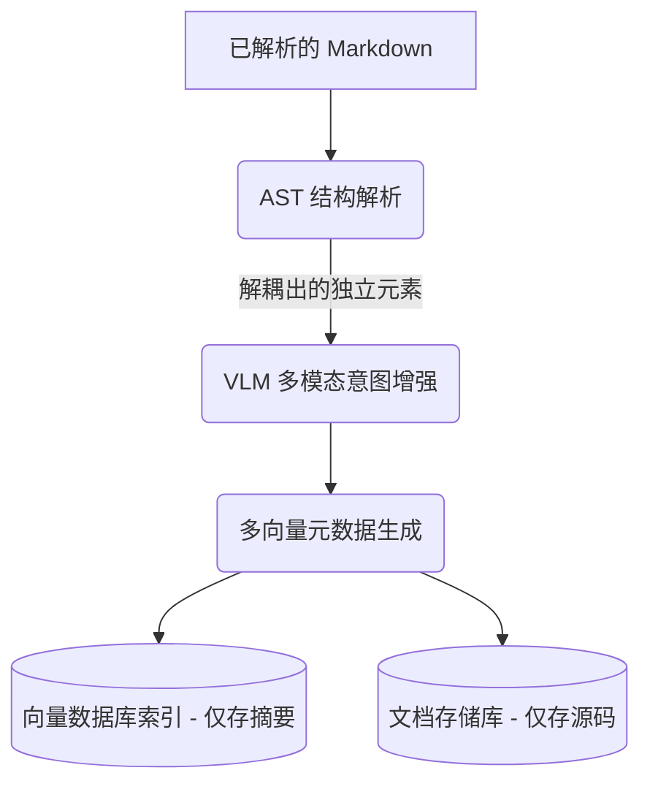

# RAG 增强注释与分块工具包 (RAG Enhanced Caption & Chunking Toolkit)

[](https://opensource.org/licenses/Apache-2.0)
[](https://www.python.org/downloads/)

[**English**](README.md) | [**中文**](README_zh.md)

这是一个模块化的多模态 RAG (Retrieval-Augmented Generation) 增强工具包。本项目基于先进的**多向量架构 (Multi-Vector Architecture)**，提供了高度解耦的模块，用于精准的 Markdown 上下文提取、基于视觉大模型 (VLM) 的图片/表格注释增强，以及感知文档结构的语义分块。

灵感来源于 [RAG-Anything](https://github.com/HKUDS/RAG-Anything)。

## 💡 我们的理念：意图驱动 vs OCR驱动

不同于标准的仅仅执行 OCR 和转录图片文字的多模态 RAG 工具，本工具包专注于**解释意图 (Illustrative Intent)**：
- **感知上下文 (Context-Aware)**：VLM 不仅能“看”到图片/表格，还能知道它在文档中的**位置**，以及周围的文本讲述了**什么**。
- **聚焦意图 (Intent-Focused)**：工具会解释一个元素**为什么**存在（例如：“该图表证明了在 2.1 节中提到的高并发能力”），而不是单纯地罗列图表中的数字。
- **防止注意力劫持 (No Attention Hijacking)**：通过生成简洁、意图驱动的摘要，我们能够防止大语言模型 (LLM) 在生成答案时被图片中无关的原始数据“分散注意力”。

## 🎯 适用范围与前提：文档处理的“最后一公里”

请注意，**本工具包被设计为处理“已经解析好”的 Markdown 文档。** 它并非一个 PDF 解析器或 OCR 引擎（你可以在上游流程使用像 MinerU、Docling 或 Marker 等专门的文档提取工具）。

本项目作为数据灌入向量数据库 (Vector DB) 进行检索，或者用于构建知识图谱 (Knowledge Graph) 之前的关键**“最后一公里”**加工步骤——负责精炼、强化和结构化原本零散的 Markdown 数据。

## ✨ 核心能力

- **基于 VLM 的增强注释 (`enhancer`)**：自动分析文档中的图片和表格。提取核心业务实体，并生成高浓度的语义摘要。
- **外科手术式上下文提取**：利用 `markdown-it-py` 进行语法树解析，为 VLM 收集深度的情境感知信息（包括面包屑导航、父级标题和相邻段落）。
- **结构感知的语义分块 (`chunker`)**：区别于传统机械地按字数 (Character-count) 切分，我们的引擎基于抽象语法树 (AST) 解析 Markdown，不仅能保留文档的原始层级结构和上下文，更结合 Embedding 模型进行真正的语义聚类切分。

### 🧬 多向量处理流水线 (Multi-Vector Pipeline)

我们的分块引擎采用多阶段处理流水线，旨在最大程度保留文档的原始逻辑语境，同时**彻底将含有噪音的 Markdown 代码与向量 Embedding 分离**：

1.  **阶段一：AST 结构化解析**：利用 `markdown-it-py` 将文档解析为 Token 语法树。系统能精准识别出表格 (Table)、数学公式 (Math Block) 和图片 (Image) 等结构化元素，并将它们与普通文本**完全解耦**。
2.  **阶段二：标题路径聚合 (Breadcrumbs)**：系统会为每一个切片自动注入完整的层级路径（例如：`["一级标题", "二级标题", "子标题"]`）作为元数据。
3.  **阶段三：图文/表文绑定**：专门的探测器会强制将图片链接及其随后的题注（Caption）绑定在同一个切片中，防止检索时发生语义断裂。
4.  **阶段四：非对称向量化 (Multi-Vector)**：
    *   **子节点 (元素)**：表格和图片被处理为独立的子节点。**只有 VLM 生成的纯净语义摘要会被送去向量化**，防止表格的排版代码（如 `|---|`）污染向量空间。
    *   **父节点 (文本)**：原汁原味的复杂 Markdown 源码（如长表格或 LaTeX）被安全地隔离在文档库 (Docstore) 中，永不直接参与 Embedding 计算。

## 🔄 双轨处理系统与输出格式

本项目输出极其纯净、高度结构化的 JSONL 数据，开箱即用于企业级的大规模 RAG 部署。

我们不把所有东西混在一起，而是采用**多向量架构 (Multi-Vector Architecture)**（将用于检索的文本和最终喂给大模型的文本彻底解耦）。

1.  **轨道一：向量数据库载荷 (`_index.jsonl`)**
    *   **用途**：专为昂贵、要求高性能的内存计算型向量数据库（如 Milvus, Qdrant）设计。
    *   **格式**：仅包含超轻量、高密度的语义文本（纯文本段落或 VLM 摘要）。没有任何 Markdown 表格代码或图片链接等噪音。
    ```json
    {
        "id": "chunk_001",
        "text_for_embedding": "由 VLM 生成的、解释表格核心业务指标的高浓度摘要。",
        "metadata": {"element_type": "Table"}
    }
    ```

2.  **轨道二：文档存储库载荷 (`_docstore.jsonl`)**
    *   **用途**：包含完整原文、Markdown 表格和实体的重型数据。专为便宜、大容量的 NoSQL 数据库（如 MongoDB, Redis 等）设计。
    *   **格式**：检索时，向量库秒级命中轻量子节点，随后系统根据 `parent_id` 或 `id` 回表，召唤出完整的 Markdown 上下文。
    ```json
    {
        "id": "chunk_001",
        "full_content": "| 原始 | Markdown | 表格 | ...", 
        "parent_id": "chunk_000",
        "header_path": ["第一章", "1.1 节"],
        "element_type": "Table",
        "entities": ["关键指标 A", "组件 B"]
    }
    ```

### 🌊 架构工作流 (Architecture & Workflow)



## 🚀 快速开始

### 安装

```bash
# 克隆仓库
git clone https://github.com/Flying-Henanese/rag_enhanced_caption.git
cd rag_enhanced_caption

# 使用 uv 安装依赖
uv sync
uv sync --extra local # 可选：如果需要本地 Embedding 模型支持
uv sync --extra demo  # 可选：用于运行 FastAPI 后端和高级 LlamaIndex 演示
```

### ⚙️ 环境配置
在项目根目录下创建一个 `.env` 文件：
```env
VLM_API_KEY=your_key_here
VLM_ENDPOINT=https://api.siliconflow.cn/v1/chat/completions
VLM_MODEL_NAME=Qwen/Qwen3-VL-8B-Instruct
# 如果配置了结合远程 Embedding 的语义分块：
EMBEDDING_API_KEY=your_key_here
EMBEDDING_ENDPOINT=https://api.siliconflow.cn/v1/embeddings
EMBEDDING_MODEL_NAME=BAAI/bge-m3
# 如果配置了结合远程 Rerank 模型的精排：
RERANK_API_KEY=your_key_here
RERANK_ENDPOINT=https://api.siliconflow.cn/v1/rerank
RERANK_MODEL_NAME=Pro/BAAI/bge-reranker-v2-m3
```

### 1. 核心：“四级火箭”高级检索引擎

正因为本工具包输出的数据极其干净规范，你可以以此构建企业级的高阶检索流水线。我们在 `examples/llama_index_advanced_rag.py` 中提供了一个极佳的范例。

它演示了如何组装一个 **4 级检索引擎**，以达到“极高精度”与“海量上下文”的完美平衡：

1.  **纯向量初筛 (Vector Search)**：在 `_index.jsonl` 中扫荡最匹配的纯文本或 VLM 摘要（Top-15）。
2.  **指针回表 (Recursive Retrieval)**：一旦命中 VLM 摘要，检索器会顺着指针，去 `_docstore.jsonl` 中把带排版的完整 Markdown 原文（大表格/图文）打捞出来。
3.  **前置精排 (Rerank)**：**关键的一步，我们在合并前执行精排。**此时所有的切片都很短小，交由 Cross-Encoder 模型打分过滤（精选 Top-5），彻底避免了因为合并导致文本过长而在 512 token 处被截断的致命陷阱。
4.  **上下文合并 (AutoMerging)**：最后，系统检查过滤出的精华碎片。如果发现某几个碎片都同属于某个大章节（依据 `header_path`），它会大笔一挥，把整个宏大且连贯的章节打包，投喂给大模型。

```bash
# 运行高级检索演示
uv run python examples/llama_index_advanced_rag.py
```

### 2. 数据灌入流水线 (独立演示)

该脚本演示了如何读取原始 Markdown，调用语义分块和 VLM 增强，最后将结构化数据非对称地保存为 `_docstore.jsonl` 和 `_index.jsonl`。
```bash
uv run python examples/data_ingestion_pipeline.py
```

### 3. API 与 Web 端演示
我们提供了一个 FastAPI 后端，用于交互式体验完整的流水线处理。
```bash
uv run python backend/main.py
```

### 📊 召回对比评测 (对比传统 RAG 的“降维打击”)

我们在 `test_resource/` 目录下使用了像 **PaddleOCR** 和 **RAG-Anything** 这样极其复杂的“硬核”技术文档进行了对比测试：

| 测试场景 | 传统基线 (Naive RAG) | 本工具包 (Advanced Strategy) | 最终效果 |
| :--- | :--- | :--- | :--- |
| **复杂 Markdown 表格** | 表格常被从中切断，丢失行列对齐语义。 | 多向量摘要指针 + 递归回表召回完整表格。 | ✅ 结构化数据 100% 完整召回。 |
| **多模态图表理解** | 仅召回图片链接或 Alt 文本，大模型只能“盲猜”。 | 利用 VLM 增强摘要进行高维向量空间计算。 | ✅ 基于“说明意图”的高精度召回。 |
| **深层嵌套标题** | 召回孤立段落，丢失上级版本号或章节语境。 | 面包屑导航 + 逻辑树合并，自动回溯完整章节。 | ✅ 上下文极度丰满，无任何语义断层。 |
| **大篇幅合并 + 重排** | 合并出的大章节在精排时被无情截断，导致错杀。 | 颠倒顺序：先对短切片精排打分，再执行合并组装。 | ✅ 满分精排，零截断。 |

## 🛠️ 项目结构

```text
rag_enhanced_caption/
├── cli.py                           # 命令行界面 (主入口)
├── examples/                        # 演示脚本与评估工具
│   ├── data_ingestion_pipeline.py   # 多向量 RAG 数据生产流水线
│   └── llama_index_advanced_rag.py  # 4 级火箭高级检索策略演示
├── backend/
│   ├── main.py                      # FastAPI Web 后端
│   └── rag_pipeline.py              # 高级 LlamaIndex 封装与核心驱动
├── src/
│   └── rag_enhanced_caption/        # 顶层包目录
│       ├── chunker/                 # AST 感知的语义分块模块
│       └── enhancer/                # 视觉到文本的多模态增强模块
└── tests/                           # 统一的单元与集成测试套件
```

## 📄 开源协议
Apache-2.0 License.