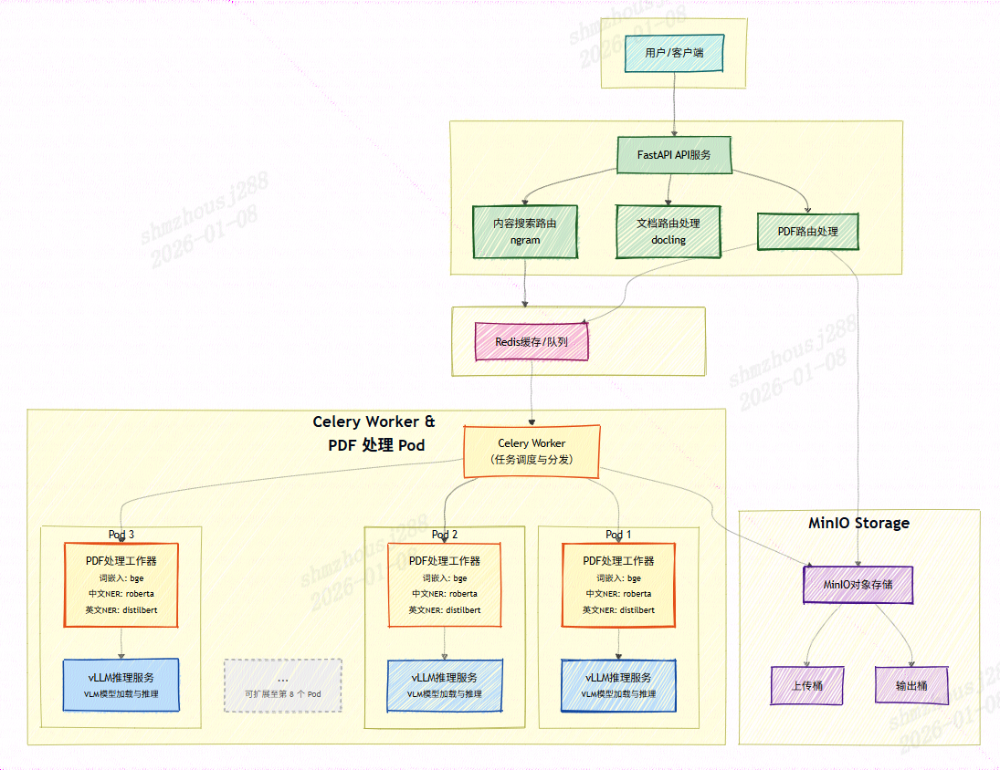
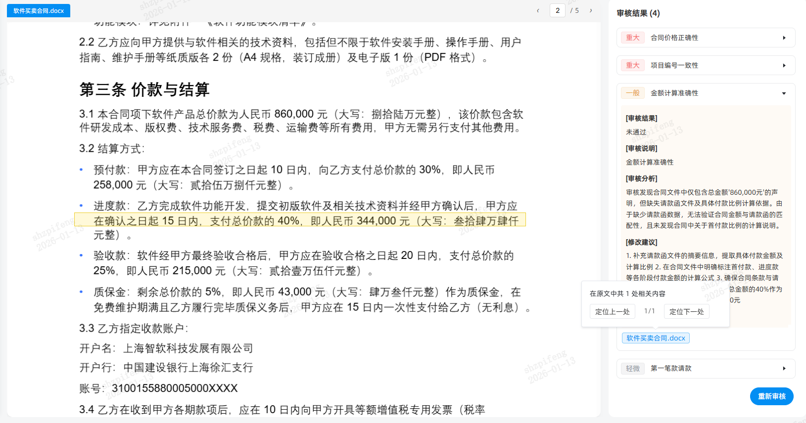

## 高性能文档解析方案|痛点与挑战

在传统的RAG知识库前置处理过程中，我们面临着诸多挑战：
- **格式繁杂兼容难**：企业文档格式多样，传统工具（例如python-docx和pymupdf）难以同时高质量处理 Office 文档和复杂的 PDF 扫描件。
- **语义割裂检索差**：简单的按字符切分导致上下文丢失，检索匹配度低，无法满足业务需求。
- **解析效率瓶颈**：面对海量存量文档，缺乏高并发处理能力，响应速度慢，难以支撑大规模应用。

---

## 高性能文档解析方案|技术方案概览

为了解决上述问题，我们构建了一套高性能、可扩展的文档处理架构：
- **全格式支持**：全面覆盖 **Word、Excel、PDF、PPT和图片**等主流办公文档格式。
- **高精度解析**：通过引入MinerU VLM模型实现准确的布局解析和元素提取。
- **跨平台支持**：同时支持**英伟达CUDA和华为CANN框架。**
- **知识库应用优化**：为了更好支持上层应用，解析后增加了智能切分和实体识别功能，增强后续的检索效果。
- **高并发架构设计**：
- 采用 **FastAPI** 作为服务入口，保障请求的高效接收与响应。
- 采用 **FastAPI** 作为服务入口，保障请求的高效接收与响应。
- 引入 **Celery** 分布式任务队列，实现请求响应与处理过程的完全解耦，有效应对流量洪峰，保障系统稳定性和可用性。
- **资源利用最大化**：通过创建多组 **Celery Worker**（执行CPU密集任务） + **vLLM Server**（执行GPU密集推理任务）的Pod单元，实现对多核CPU+多卡GPU的并行调用，大幅提升单机处理吞吐量。
- 使用Docker Compose进行服务编排，不同功能划分为不同的进程，保证服务的并发量和性能。

---

## 高性能文档解析方案|技术方案概览



---

## 高性能文档解析方案|架构设计

| 服务名称 | 容器名称 | 职责描述 |
| --- | --- | --- |
| **mineru-api** | `mineru-api` | **API 网关：**基于 FastAPI，提供对外 HTTP 接口 。负责接收请求、鉴权及任务分发。 |
| **mineru-worker** | `mineru-worker` | **异步任务处理器：**基于 Celery，负责 PDF 解析、OCR、文档转换等耗时任务。 |
| **vllm** | `mineru-vllm` | **推理后端：**运行 MinerU 视觉大模型 (VLM)，提供高并发的文档理解与提取能力。 |
| **redis** | `mineru-redis` | **消息中间件：**作为 Celery 的 Broker 和 Backend，同时缓存部分运行时数据。 |

<details>
<summary>🤖 <b>AI 图像/表格解析</b></summary>

<image_analysis>
- **核心总结**: 该表展示了高性能文档解析系统架构中的核心服务组件及其职责分工，旨在说明系统如何通过模块化设计实现高并发、异步处理与智能推理能力。API 网关负责请求入口与分发，异步任务处理器处理耗时操作，视觉大模型提供智能理解能力，Redis 作为消息队列与缓存支撑整体解耦与性能优化。这种结构在高性能文档解析场景中至关重要，确保系统可扩展、响应快、资源利用率高。
- **关键实体**: table_entity
- **简短摘要**: 该表描述了高性能文档解析系统中各服务组件的名称、容器标识及核心职责，用于支撑架构设计中的模块化、异步化与智能推理能力。
</image_analysis>
</details>


---

### 高性能文档解析方案|核心技术亮点|1. 多模态融合的高精度解析

针对不同类型的文档，我们采用了差异化的解析策略，以确保最佳效果：
- **Office 文档**：利用 **Docling** ，快速、精准地从文件中提取文本与格式信息。
- **复杂 PDF 文档**：引入 **MinerU 视觉大模型（VLM）**，该模型具备类似人类的视觉能力，能够深度理解文档排版，完美还原文档结构和准确提取页面上的公式和表格元素，并统一输出为标准的 Markdown 格式。

---

### 高性能文档解析方案|核心技术亮点|1. 多模态融合的高精度解析


原始文件


<details>
<summary>🤖 <b>AI 图像/表格解析</b></summary>

<image_analysis>
- **核心总结**: 该图像展示了一组用于计算绕组温升的数学公式，其核心作用是作为‘多模态融合的高精度解析’技术中一个具体的、可量化的技术实现案例。它通过提供精确的数学模型（公式18和19），直观地证明了该方案在处理复杂工程计算时的严谨性和高精度，从而支撑了‘高性能文档解析方案’中‘高精度’这一核心亮点。
- **关键实体**: %E5%85%BC%E5%BC%8F1_3%E8%A7%A3%E6%9E%90%E5%90%8E%E9%A2%84%E8%A7%88
- **简短摘要**: 该图像通过展示精确的温升计算公式，作为‘多模态融合的高精度解析’技术的一个具体实例，用以证明方案在工程计算中的高精度和严谨性。
</image_analysis>
</details>


解析后效果

---

### 高性能文档解析方案|核心技术亮点|2. 智能表格处理

针对文档中的表格数据，我们提供了两种灵活的转换方式，满足不同应用场景的需求：
- **键值对转换**：将表格行列关系转换为自然语义表达，便于大模型理解和问答。并且**支持合并单元格的处理**，避免生成关系错乱的表格数据。例如，将”产品名称 | 价格 | 库存”的表格转换为”产品名称：A；价格：100元，库存：50件；产品名称：B；价格：150元，库存：30件”等键值对形式。
- **Markdown表格转换**：保持表格的原始结构，转换为标准的Markdown表格格式，便于上层应用中可视化展示。

---

### 高性能文档解析方案|核心技术亮点|2. 智能表格处理


<details>
<summary>🤖 <b>AI 图像/表格解析</b></summary>

<image_analysis>
- **核心总结**: 该图像展示了一个结构化的表格，用于定义和量化特定测试装置在不同电气参数（如电压、频率、谐波）下的性能指标及其最大允许偏差。在‘高性能文档解析方案’的‘智能表格处理’章节中，此图像作为核心示例，用于证明系统能够准确识别、解析并结构化处理复杂、多层级的表格数据，特别是那些包含合并单元格和多行标题的表格。它直观地展示了系统在提取关键性能参数及其容差范围方面的精确能力。
- **关键实体**: %E8%A1%A8%E6%A0%BC1_1%E5%8E%9F%E5%A7%8B%E6%96%87%E4%BB%B6
- **简短摘要**: 该表格示例用于说明系统能精准解析包含合并单元格的复杂表格结构，提取性能指标及其最大允许偏差，从而验证其智能表格处理能力。
</image_analysis>
</details>


原始表格


<details>
<summary>🤖 <b>AI 图像/表格解析</b></summary>

<image_analysis>
- **核心总结**: 该图像展示了一个表格的局部，其内容是关于机组电网适应性测试装置的性能指标及其最大允许偏差。在‘高性能文档解析方案’章节的‘智能表格处理’技术亮点下，此图像作为示例，用于证明系统能够准确识别和结构化处理复杂、多列、包含专业术语的表格数据。它直观地展示了系统如何将原始测试数据转化为结构化的性能指标表，从而验证其在处理专业文档时的精确性和智能化能力。
- **关键实体**: %E8%A1%A8%E6%A0%BC1_3%E8%A7%A3%E6%9E%90%E5%90%8E%E9%A2%84%E8%A7%88
- **简短摘要**: 该图像作为示例，用于演示系统对专业测试表格的智能解析能力，通过展示结构化的性能指标数据，证明其在处理复杂文档时的准确性。
</image_analysis>
</details>


markdown格式表格


<details>
<summary>🤖 <b>AI 图像/表格解析</b></summary>

<image_analysis>
- **核心总结**: 该图像展示了一个表格的局部，其内容是关于电网适应性试验平台的性能指标与允许偏差。在当前章节‘高性能文档解析方案 > 核心技术亮点 (2. 智能表格处理)’的语境下，此图像并非用于展示其自身文本内容，而是作为一个典型示例，用以说明文档解析系统在处理复杂表格结构时的能力。它直观地展示了表格中包含的多行数据、多列属性（如序号、测试内容、性能指标、最大允许偏差），以及其标题和注释结构，从而证明该系统能够准确识别和结构化此类表格数据，这是‘智能表格处理’技术的核心价值。
- **关键实体**: %E8%A1%A8%E6%A0%BC1_4%E5%88%87%E5%88%86%E5%90%8E
- **简短摘要**: 作为智能表格处理技术的示例，该图像展示了一个包含多行多列性能指标数据的表格，用于证明系统能准确解析复杂表格结构。
</image_analysis>
</details>


key-value格式表格
此外，**针对过长的表格，支持按照长度切分，在不丢失信息的前提下**适配向量数据库的存储，保证后续的检索效果。


<details>
<summary>🤖 <b>AI 图像/表格解析</b></summary>

<image_analysis>
- **核心总结**: 该图像展示了一个结构化的表格，用于演示高性能文档解析方案中‘智能表格处理’技术的核心能力。它通过精确解析并保留原始文档中复杂的表格结构（包括多行合并单元格、跨行数据、多列标题和精确数值对齐），证明了系统能够准确识别并还原表格的语义和视觉布局，从而实现对复杂工程数据的可靠提取与处理。
- **关键实体**: %E8%A1%A8%E6%A0%BC2_3%E8%A7%A3%E6%9E%90%E5%90%8E%E9%A2%84%E8%A7%88
- **简短摘要**: 该图像通过展示一个包含多行合并单元格和复杂数值结构的工程表格，直观证明了智能表格处理技术在解析复杂文档时的结构还原能力。
</image_analysis>
</details>


原始表格

---

### 高性能文档解析方案|核心技术亮点|2. 智能表格处理|表格切分后


<details>
<summary>🤖 <b>AI 图像/表格解析</b></summary>

<image_analysis>
- **核心总结**: 该图像展示了一个被智能表格处理系统成功切分后的表格片段，其结构清晰，内容完整。它作为‘智能表格处理’技术的直接视觉证据，证明了系统能够将原本可能因格式混乱或排版错误而难以解析的复杂表格，精准地分割为多个独立、可读的表格单元（此处为Part 1和Part 2）。这直接服务于‘高性能文档解析方案’的核心目标，即提升表格数据的提取准确率和处理效率。
- **关键实体**: %E8%A1%A8%E6%A0%BC2_4%E5%88%87%E5%88%86%E5%90%8E
- **简短摘要**: 该图像直观地演示了智能表格处理技术成功将一个复杂表格切分为两个独立部分（Part 1 和 Part 2）的效果，证明了该技术在结构化数据解析中的有效性。
</image_analysis>
</details>


表格切分后

---

### 高性能文档解析方案|核心技术亮点|3. 基于语义的智能切分

摒弃了传统机械的字数切分方式，我们引入了 **BGE Embedding 模型**。通过计算文本向量并利用相似度聚类算法，将含义紧密相关的段落自动聚合。这种方式确保了每一个数据切片都是一个完整的”语义单元”，大幅提升了后续检索的准确性。与此同时，模型规模为24M，资源占用率极小，对整体解析流程的影响微乎其微。


<details>
<summary>🤖 <b>AI 图像/表格解析</b></summary>

<image_analysis>
- **核心总结**: 该图像作为图C.1，是文本中关于叶片在单轴加载过程中因变形和角度变化导致载荷方向改变的视觉化说明。它被放置在此处是为了直观地辅助理解文本中描述的力学原理，即叶片变形如何导致载荷方向角改变，进而影响力矩和夹具对叶片表面的压力分布，从而证明基于语义的智能切分技术在分析此类复杂工程问题时的必要性。
- **关键实体**: %E8%AF%AD%E4%B9%89%E5%88%86%E6%9E%901_2%E8%A7%A3%E6%9E%90%E5%90%8E
- **简短摘要**: 图C.1用于可视化展示叶片变形和角度变化如何影响载荷方向，从而辅助说明文本中关于载荷力学行为的复杂分析。
</image_analysis>
</details>


语义切分前1


<details>
<summary>🤖 <b>AI 图像/表格解析</b></summary>

<image_analysis>
- **核心总结**: 该图像作为图C.1，用于直观展示叶片在受载荷时因大变形而引起的载荷方向角变化及其对叶片局部压力的影响。它在文本中被引用，旨在为‘大变形和载荷方向的影响’这一技术要点提供视觉化证据，具体说明了当载荷方向与叶片弹性轴不垂直时，会产生附加力矩，从而导致夹具对叶片表面产生较高局部压力。图像在结构上服务于论证，是支撑‘基于语义的智能切分’这一核心技术亮点中关于载荷方向变化影响分析的必要组成部分。
- **关键实体**: %E8%AF%AD%E4%B9%89%E5%88%86%E6%9E%901_4%E5%88%87%E5%88%86%E5%90%8E
- **简短摘要**: 该图用于说明叶片在大变形下载荷方向角的变化及其对局部压力的影响，是论证‘大变形和载荷方向的影响’这一技术要点的关键视觉证据。
</image_analysis>
</details>


语义切分后2


<details>
<summary>🤖 <b>AI 图像/表格解析</b></summary>

<image_analysis>
- **核心总结**: 该图像展示了一段关于混凝土塔架结构设计的详细技术规范文本，其内容聚焦于设计方法、安全等级、疲劳设计、分析方法及连接构造等具体要求。在“高性能文档解析方案 > 核心技术亮点（3. 基于语义的智能切分）”这一章节背景下，此图像被用作一个典型示例，旨在证明该方案能够精准识别并提取出文档中具有明确结构层次和专业语义的段落与条款。图像中的文本内容本身是结构化的技术规范，其清晰的编号体系（如7.1.1.1, 7.1.1.2等）和分点论述形式，恰好体现了“基于语义的智能切分”技术能够有效识别并保留文档原有的逻辑结构，而非简单地进行字符级切割。
- **关键实体**: %E8%AF%AD%E4%B9%89%E5%88%86%E6%9E%902_2%E8%A7%A3%E6%9E%90%E5%90%8E
- **简短摘要**: 该图像展示了一段结构化的技术规范文本，用于演示“基于语义的智能切分”技术能准确识别并保留文档原有的层级结构和专业语义。
</image_analysis>
</details>


语义切分前2


<details>
<summary>🤖 <b>AI 图像/表格解析</b></summary>

<image_analysis>
- **核心总结**: 该图像展示了文档中关于‘混凝土塔架’设计规范的连续文本段落，其核心作用是作为‘基于语义的智能切分’技术的实例。它直观地呈现了在语义上高度连贯的、属于同一主题（混凝土塔架基本规定）的文本块，证明了该技术能够准确识别并保留此类语义单元，而非简单地按字符或行切割，从而确保了解析结果的完整性和上下文一致性。
- **关键实体**: %E8%AF%AD%E4%B9%89%E5%88%86%E6%9E%902_3%E5%88%87%E5%88%86%E5%90%8E
- **简短摘要**: 该图像展示了一段语义连贯的混凝土结构设计规范文本，用以说明‘基于语义的智能切分’技术能精准识别并保留完整的技术段落，避免因机械切割导致内容断裂。
</image_analysis>
</details>


语义切分后2

---

### 高性能文档解析方案|核心技术亮点|4. 上下文感知的标题聚合

针对企业长文档层级复杂的特点，我们开发了**标题聚合功能**。系统会自动将多级标题信息聚合到对应的段落中。无论文档如何切分，每个切片都能保留”父级标题-子标题”的完整路径，有效解决了碎片化导致的上下文丢失问题，从而提升了后续检索的准确性和相关性。

多级标题聚合

---

### 高性能文档解析方案|核心技术亮点|5. 关键信息自动提取

为了进一步提升检索效率，我们集成了中英文的 **NER（命名实体识别）模型**。在解析过程中，系统会自动抽取文档中的组织机构、人名、专有名词等关键实体，为文档打上”智能标签”，实现多维度的精准检索。


---

### 高性能文档解析方案|核心技术亮点|6. 内容检索


<details>
<summary>🤖 <b>AI 图像/表格解析</b></summary>

<image_analysis>
- **核心总结**: 该图像作为‘高性能文档解析方案’章节中‘内容检索’部分的视觉示例，其核心作用是展示系统在处理复杂技术文档时的界面交互能力。它通过高亮显示文档中的特定章节标题（7.3.2 叶片描述）和关键内容（如‘叶片描述’），直观地证明了系统能够精准定位并提取文档中的结构化信息，从而支持高效的全文检索和内容导航功能。
- **关键实体**: image%203
- **简短摘要**: 该图像通过高亮文档中的章节标题和关键内容，直观演示了高性能文档解析系统在内容检索方面的精准定位与结构化信息提取能力。
</image_analysis>
</details>


原始PDF页面

搜索关键字“叶片描述”
返回结果如下：
```
{
    "status": "success",
    "message": "搜索成功",
    "data": {
        "result": [
            {
                "page_idx": 14,
                "span_range": [
                    0,
                    0
                ],
                "bbox": [
                    70,
                    586,
                    525,
                    614
                ]
            },
            {
                "page_idx": 14,
                "span_range": [
                    0,
                    0
                ],
                "bbox": [
                    69,
                    625,
                    147,
                    638
                ]
            }
        ]
    }
}

```
应用展示


<details>
<summary>🤖 <b>AI 图像/表格解析</b></summary>

<image_analysis>
- **核心总结**: 该图像展示了一个文档审核系统界面，其核心功能是通过高亮显示并分析文档中特定条款（如“在确认之日起15日内，支付总总价款的40%”）来辅助人工审核。它直观地演示了系统如何将用户关注的文本内容从原始文档中提取、高亮并关联到审核意见，从而证明该方案在内容检索层面实现了精准定位与语义关联，有效支持了“内容检索”这一核心技术亮点。
- **关键实体**: c17614a4ad447a787d3a1131825a2d22
- **简短摘要**: 该图像展示了文档审核系统如何通过高亮显示关键条款并关联审核意见，以证明其在内容检索方面的精准定位能力。
</image_analysis>
</details>


---

### 高性能文档解析方案|核心技术亮点|7. 性能优化

通过将CPU密集型任务和GPU密集型任务切分为相互独立的进程，更好利用了高性能服务器的硬件资源，不仅可以进行多路解析，在单任务的处理上也有显著提升。在附加了实体识别和智能分段等附加功能，处理时间和使用MinerU CLI所需的时间几乎没有差别。在多路服务器上可以通过简单配置，使不同的任务使用服务器上独立硬件资源，成倍提速。

---

### 高性能文档解析方案|核心技术亮点|7. 性能优化

| 解析样例 | 原生MinerU | 本方案 |
| --- | --- | --- |
| PDF测试1（158页英文内容） | 79.26s | 22.661 |
| PDF测试2（731页英文内容） | 402s | 133s |
| PDF测试2（670页中文内容） | 163 | 36.53 |

---

### 高性能文档解析方案|核心技术亮点|7. 性能优化

测试环境：
- GPU: 4 x NVIDIA A100 80GB
- CPU: Intel(R) Xeon(R) Gold 6348 CPU @ 2.60GHz

---

## 高性能文档解析方案|核心组件

| 依赖名称 | 版本范围 | 功能描述 |
| --- | --- | --- |
| **fastapi** | `>=0.115.12` | **Web 框架**：提供高性能的 API 服务接口，支持异步编程。 |
| **mineru** | `>=2.5.0` | **核心引擎**：MinerU 核心库，提供 PDF 解析、布局分析和公式提取能力。 |
| **celery** | `>=5.5.3` | **异步任务队列**：用于处理耗时的 PDF 解析和 NLP任务。 |
| **vllm** | `>=0.11.0` | **大模型推理**：高性能 LLM/VLM 推理引擎，用于加速VLM视觉大模型的推理。 |
| **transformers** | `>=4.53.0` | **NLP 模型库**：用于加载和运行各种预训练模型（如 NER、Embedding）。 |
| **minio** | `>=7.2.15` | **对象存储客户端**：用于上传和下载 PDF 源文件及解析后的结果文件。 |
| **sentence-transformers** | `>=5.1.0` | **文本向量化**：用于生成文本 Embedding，实现基于文本语义的切分。 |
| **sqlalchemy** | `>=2.0.41` | **ORM 框架**：用于数据库操作和连接管理。 |
| **redis** | (Implied) | **缓存与消息中间件**：作为 Celery 的 Broker 和应用缓存（通过 `redislite` 或外部服务）。 |

---

## 高性能文档解析方案|应用价值

- **提质**：将非结构化文档转化为高质量的 Markdown 数据，为大模型知识库建设提供了坚实的基础。
- **增效**：通过自动化、并行化的处理流程，结合软件架构的优化，将文档处理效率提升数倍，实现了从“小时级”到“分钟级”的跨越。
- **赋能**：该平台可广泛应用于政策文件检索、合同智能审核、技术文档问答等多种业务场景，切实助力企业提效减负。

---

## 高性能文档解析方案|应用价值

| 对比维度 | 原生 MinerU | 本方案 | 优势 |
| --- | --- | --- | --- |
| **系统架构** | 单体应用，命令行工具 | 分布式微服务架构（FastAPI + Celery + vLLM + Redis） | 支持高并发、可水平扩展，适合企业级部署 |
| **服务化能力** | 无服务接口，需本地调用 | 提供 RESTful API，支持 HTTP 调用 | 易于集成到现有系统，支持多语言调用 |
| **并发处理** | 单任务串行处理 | 分布式任务队列，支持多 Worker 并行 | 处理效率提升数倍，支持海量文档批量处理 |
| **资源利用** | CPU/GPU 资源利用率低 | CPU 密集任务与 GPU 推理任务分离，多卡并行 | 单机吞吐量大幅提升，资源利用最大化 |
| **文档格式支持** | 主要支持 PDF | 全格式支持（Word、Excel、PDF、PPT、图片） | 一站式解决企业多格式文档处理需求 |
| **表格处理** | 基础表格识别 | 智能表格处理（键值对转换 + Markdown 表格） | 满足问答和可视化展示双重场景需求 |
| **文本切分** | 无切分功能 | 基于语义的智能切分（BGE Embedding + 聚类） | 保证语义完整性，提升检索准确性 |
| **上下文管理** | 无标题聚合功能 | 上下文感知的标题聚合（多级标题路径保留） | 解决碎片化导致的上下文丢失问题 |
| **信息提取** | 无实体识别功能 | 集成 NER 模型，自动提取关键实体 | 支持多维度精准检索，为文档打智能标签 |

---

